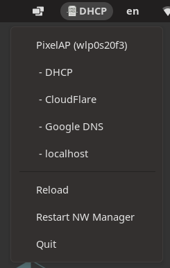
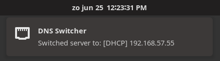
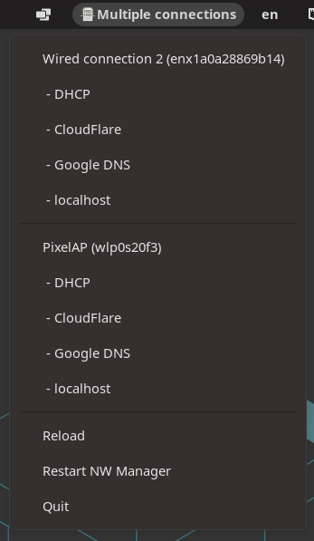

# Gnome appindicator dns switcher


- GitHub: https://github.com/annervisser/gnome-dns-switcher
- PyPi:   https://pypi.org/project/gnome-dns-switcher/
---

Gnome appindicator (toolbar icon) tool to quickly switch between different DNS servers
- Easily available in your toolbox
- Config file to specify DNS servers
Supports multiple connections and switching them separately
- Utility button to restart NetworkManager


<details>
<summary>💻 Screenshots</summary>




#### Easily available in your toolbar


#### Shows you what it's done, no surprises


#### Supports multiple connections and switching them separately


</details>

## Setup
Install dependencies
```shell
# Install pipx:
sudo apt install pipx

# Add pipx path to your .bashrc
pipx ensurepath

# Install dependencies to run this application
sudo apt install python3-dev libcairo2-dev libgirepository1.0-dev python3-gi python3-gi-cairo gir1.2-gtk-3.0 gir1.2-appindicator3-0.1
```

Install gnome-dns-switcher
```shell
pipx install gnome-dns-switcher

# Generate a default configuration
gnome-dns-switcher generate-config

# Modify the config to your needs. See config documentation below
edit ~/.config/gnome-dns-switcher.yml
```

## Usage
### Start the app in the background
Simply add ` &` after your command
```shell
gnome-dns-switcher &
```

### Specify a different configuration file (default is `~/.config/gnome-dns-switcher.yml`)
```shell
gnome-dns-switcher --config /path/to/config.yml
```

### Add to startup applications
```shell
# Sleep 10 seconds before starting to prevent starting up 
# before network connections have been made
bash -c 'sleep 10 && gnome-dns-switcher --config ~/.config/gnome-dns-switcher.yml'
```

## Config
The config file allows you to specify which DNS servers to show and what devices are visible.
By default, gnome-dns-switcher looks for a config file at `~/.config/gnome-dns-switcher.yml`

To generate and example configuration, you can run `gnome-dns-switcher generate-config`
### The generated configuration will look like this:
```yaml
servers: # DNS Server options to show
  # DHCP is always shown as the first option
  Quad9: 9.9.9.9
  CloudFlare: [1.1.1.1, 1.0.0.1]
  Google DNS:
    - 8.8.8.8
    - 8.8.4.4
devices: [] # Specify device names here if you want to hide certain devices (ip link show)
```

#### `servers` A list of servers that can be switched between
- The name is only used for displaying
- You can define one or more ips, as a yaml array or as a comma-seperated string

#### `devices` Which devices to show (optional)
- optional, will display all non-bridge connections if not present or empty
- one or more devices to show in the switcher
    - List all your devices by running `ip link show` in a terminal

## Development

### Setup
Set up virtualenv:
```shell
virtualenv venv
source venv/bin/activate
```

Install dependencies:
```shell
python setup.py install
pip install vext vext.gi
```

### Running
```shell
python -m gnome_dns_switcher
```

### Useful links

- https://gjs-docs.gnome.org/
